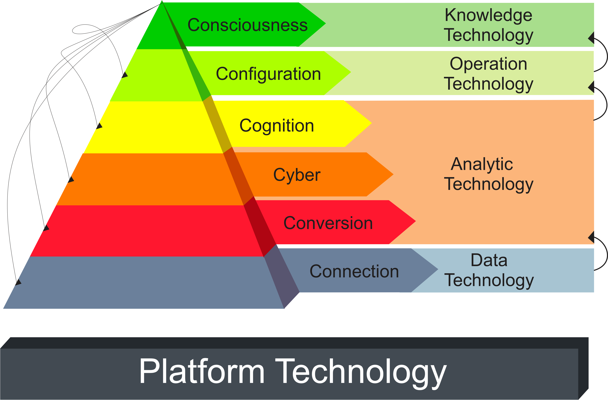
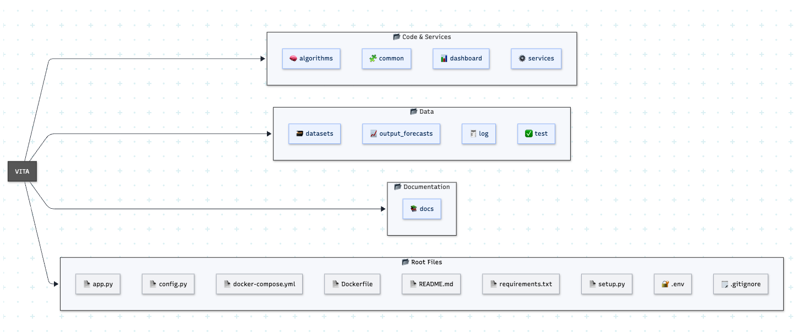

# 🌐 VITA Platform

<p align="center">
  
</p>

<p align="center">
  <b>Visionary Industrial Technology Architecture</b><br>
  A modular AI platform based on the 6C Architecture for intelligent industrial systems
</p>

<p align="center">
  
  
  
  
  
  
  
</p>

---

##  Overview

**VITA (Visionary Industrial Technology Architecture)** is an AI-powered modular platform designed to enable the **practical implementation of the 6C Architecture** in industrial environments.

Beyond a traditional AI system, VITA incorporates **MLOps principles**, enabling the **continuous lifecycle management of machine learning models**, from data ingestion to deployment, monitoring, and evolution.

Developed as part of doctoral research, VITA bridges the gap between **architectural theory, MLOps practices, and real-world industrial applications**.

---

## 🏗 6C Architecture

<p align="center">
  
</p>

The **6C Architecture** defines a layered approach for industrial AI systems:

1. **Connection** – Data acquisition from sensors, systems, APIs, and user inputs
2. **Conversion** – Data preprocessing and transformation
3. **Cyber-Physical** – Integration between digital and physical systems
4. **Cognition** – AI/ML models for detection, prediction, and analytics
5. **Configuration** – Decision-making and system adaptation
6. **Consciousness** – Continuous learning, monitoring, and system evolution

---

## 🔁 MLOps in VITA

VITA integrates **MLOps practices** across the 6C layers, enabling a **continuous and automated AI lifecycle**:

* 🔄 **Data Pipeline** – ingestion, validation, and preprocessing (Connection & Conversion)
* 🤖 **Model Training & Inference** – AI services exposed via API (Cognition)
* 🚀 **Deployment** – models served through FastAPI endpoints
* 📊 **Monitoring** – logging, performance tracking, and system feedback (Consciousness)
* ♻️ **Continuous Improvement** – iterative updates and retraining pipelines

This ensures that VITA is not just a static system, but a **living AI platform capable of adapting over time**.

---

## 📂 Project Structure

<p align="center">
  
</p>

VITA is structured as a modular platform composed of:

* **Code & Services** – AI models, APIs, and business logic
* **Data Layer** – datasets, outputs, logs, and validation
* **Documentation** – Sphinx-based documentation
* **Frontend Layer** – Streamlit and React interfaces
* **Infrastructure Layer** – environment, deployment, and orchestration

---

## 🔧 Core Technologies

* **FastAPI** – Backend API and model serving
* **Streamlit** – Interactive dashboard
* **React** – Frontend interface
* **OpenCV** – Computer vision processing
* **YOLO** – Object detection models
* **Pandas / NumPy** – Data processing
* **Sphinx** – Documentation
* **Docker (optional)** – Containerization
* **MLOps Practices** – Model lifecycle, monitoring, retraining

---

## 🚀 Features

* 🔐 Authentication system (JWT-based)
* 🧠 AI Vision Module (object detection with YOLO)
* 🔁 MLOps-ready architecture
* 📊 Interactive dashboard (Streamlit)
* ⚛️ React frontend (modern UI)
* 🔗 API-first design
* 🧩 Modular architecture aligned with 6C
* 📚 Integrated documentation (Swagger + Sphinx)
* 🔄 Extensible for new AI modules and pipelines

---

## 🖥 Operational Flow Aligned with the 6C Architecture

The execution flow of the VITA platform follows the conceptual layers of the 6C Architecture:

```text id="flow-mlops"
[Connection]
Input data (images, sensors, APIs)
        ↓
[Conversion]
Data preprocessing and transformation
        ↓
[Cyber]
System integration and service orchestration (FastAPI)
        ↓
[Cognition]
AI models and inference (e.g., YOLO)
        ↓
[Configuration]
Decision-making and response generation
        ↓
[Consciousness]
Monitoring, feedback, and continuous improvement (MLOps)
```

Note: Not all layers appear as explicit sequential steps, as the 6C Architecture represents a layered structural model rather than a strict execution pipeline.

---

## ⚙️ Installation

```bash id="install-mlops"
git clone https://github.com/nandaguidotti/vita.git
cd vita

python -m venv .venv
source .venv/bin/activate

pip install -r requirements.txt
```

---

## ▶️ Running Locally

### Backend

```bash id="run-backend"
uvicorn backend.app:app --host localhost --port 8000 --reload
```

Swagger:
http://localhost:8000/docs

Docs:
http://localhost:8000/html/docs/

---

## Frontend

### Streamlit

```bash id="run-streamlit"
streamlit run frontend/streamlit/dashboard.py
```

### React

```bash id="run-react"
cd frontend/react
npm install
npm run dev
```

---

## 📚 Documentation

```bash id="docs-build"
cd docs
make clean
make html
```

```bash id="docs-serve"
python -m http.server 8000 --directory docs/build/html
```

---

## 📌 Status

🚀 **Active Research & Development**

VITA is an actively evolving platform developed as part of ongoing doctoral research.
It integrates architectural principles, artificial intelligence, and MLOps practices into a unified industrial AI framework.

The platform has been **partially validated in scientific research and real-world scenarios**, and continues to evolve with new modules, models, and industrial applications.

---

## 📄 6C Scientific Publication

The architectural foundation of VITA is supported by the following publication:

> Guidotti, F. P., da Silva Arantes, J., da Silva Arantes, M., Bedoya, A. E., & Toledo, C. F. M. (2024).
> **Six-Layer Industrial Architecture Applied to Predictive Maintenance.**
> In *Proceedings of the International Conference on Software and Data Technologies (ICSOFT)*, pp. 123–130.

---


## 👩‍💻 Author

<p>
<strong>Fernanda Pereira Guidotti Carneiro</strong><br>
<em>Ph.D. in Computer Science and Computational Mathematics – University of São Paulo (ICMC/USP)</em><br>
<em>AI Specialist in Industrial Systems, MLOps, and Intelligent Applications</em>
</p>